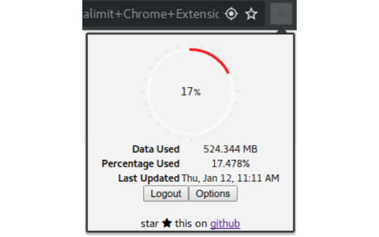
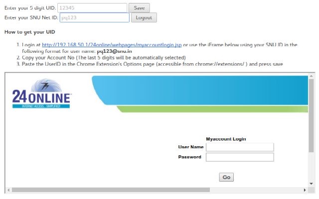

# snu-data-limit
A Chrome Extension that calculates the data you have downloaded since the last wednesday for Shiv Nadar University and helps you logout in a single click.

## Obtaining your own UID
1. Install the chrome extension.
1. Login at http://192.168.50.1/24online/webpages/myaccountlogin.jsp using your SNU ID in the following format for user name: pq123@snu.in 
1. Goto http://192.168.50.1/24online/webpages/myaccount/accountstatus.jsp
1. Copy the last five digits your Account No.
1. Paste the copied UserID in the Chrome Extension's Options page (accessible from chrome://extensions/).
1. Press Save

